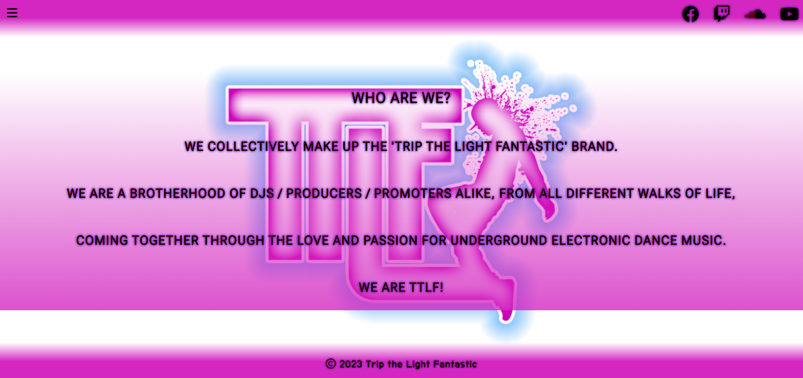
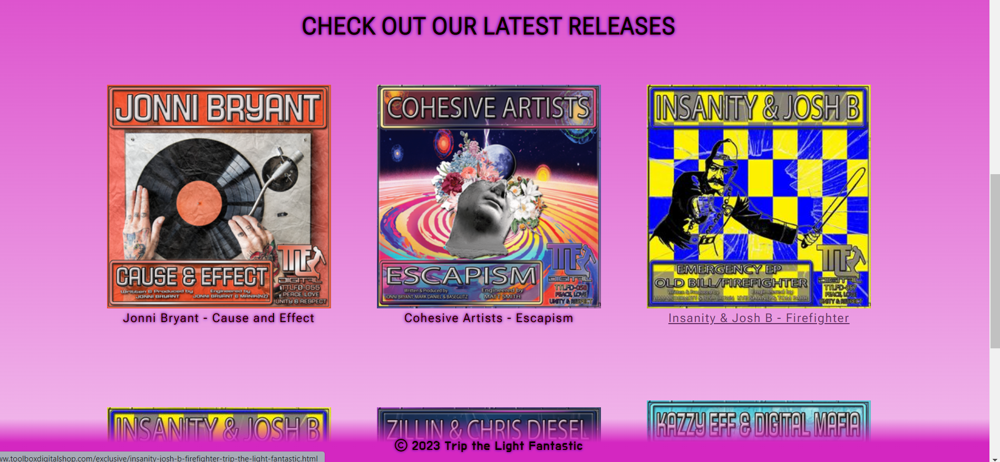
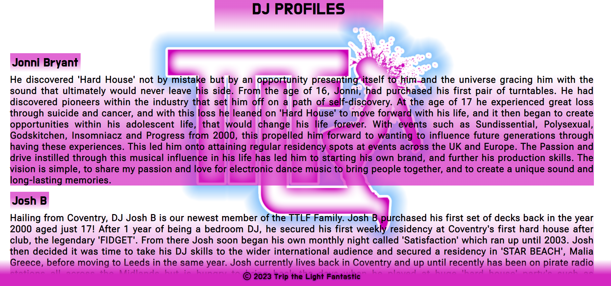
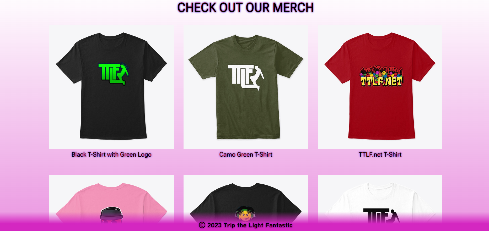

# Trip the Light Fantastic

Trip the Light Fantastic is a site for information about the digital record label based in Midlands, UK. 
The site is aimed at both new and returning visitors and will allow them to learn more about the owners by way of a DJ profile page, a gallery of latest track releases and a gallery of merchandise with links to buy items.

[View live page on Github Pages](https://markdaniel1982.github.io/ttlf_pp1/index.html)
_____
## Key Project Goals

### Site Owner
  * To provide information about who we are and what we do.
  * To engage interest as soon as the user lands on the site.
  * To allow users of the site to see a selection of our newest products.
  * To generate income from our products.

### First Time Users
  * To find out who we are and what we do.
  * To find it instinctively easy to navigate the site.
  * To easily find links to social network accounts to access more content.

### Returning Users
  * To keep up-to-date with, or to buy releases and merchandise .

_______

## Wireframes

* Mobile

___

* Tablet

___

* Desktop

_______
## Design, Features and Theme

I have chosen colours that match the brand logo that I have used as the hero image across both the main landing page and the DJ profiles page. I have not included it on the merch page as the grid container covered the image, making it a redundant element on that page.
The colour used is rgba(212, 39, 193, 1). A gradient to transparent was added for the header, footer and any elements within the pages.

### Main Page
The site lands on a page displaying the brand logo, a short 'about us' section and a gallery of the latest track releases from the label.

* Navigation and header

There is a hamburger menu which opens to display links to the pages contained within the site (DJ profiles & merch store). This is displayed across all 3 pages to allow for easier, more intuitive navigation.

* Who Are We
 
 A short paragraph with an introduction to the label.

* Latest Releases:

As you scroll down the page, there is a grid view showing the music that has most recently been released by the label, which can be purchased by clicking the link to go to an external site [Toolbox Digital Shop](https://www.toolboxdigitalshop.com/).

## DJ Profiles

On this page, there is a short text about each of the 4 owners to tell the reader more about their backgrounds. 

## Merchandise

Here I have included another grid view, similar to the "Latest Releases" on the homepage, where several different items are shown with pictures and a brief description of the item. All pictures are links which take you to the merchandise store where branded clothing items can be purchased.

All pages follow the same styling rules where the colours and fonts used match throughout and all links open in a new browers tab.

## Footer

The footer matches the colour scheme with the gradient to transparent, and also contains copyright information.

_____

## Testing
### HTML
All pages have passed through an HTML validator. A few minor issues were corrected, including a few stray end tags to be removed after re-ordering code.

### CSS
The css has also been passed through a validator. A few minor issues were corrected, including a few stray end tags to be removed after re-ordering code.

### Responsivity

All pages have been regularly checked for any responsivity issues throughout the project to ensure that all required elements were responsive to allow them to be clearly seen on all devices. Any issues were found and debugged using the devtools in the Chrome browser.

One of the main issues I had was items overlapping on the home page when viewed on smaller devices. This was fixed using Chrome Devtools to diagnose the problem, usually with position, margins or padding, and then implimented in the relevant code.

### Lighthouse
* Desktop

* Mobile

 

___

### Errors & Debugging
Throughout the project, I was checking the responsivity for smaller devices, debugging using devtools in Chrome and adjusting any elements accordingly. The main issue i had was the positioning of the hero text on the home page, which was sitting too low on smaller devices. This was fixed with a media query to reposition the element when viewed on a mobile phone.

#### Unresolved Bugs
One difficult issue I found was that my background image wasnt showing at all when the site was deployed to github pages but was displayed on the preview . After extensive searching online, the only fix I was able to find that worked, was to change the link in the style sheet so it was pointing externally to the image within my github. Obviously, this is far from ideal. and I will continue to search for a more permanent fix.
_____

## Deployment

The site was created in gitpod, and pushed to github to make it publicly accessible using the following commands in the terminal:

  * git add .
  * git commit -m "Description of updates since last commit"
  * git push

  Then, in Github, select the Repository > Settings > Pages. Then, under "Build and deployment" Select the required branch to publish from the dropdown menu, and Save.
  Once the updates have been pushed from Gitpod, they will show on the deployed page, usually after a minute or two.
_____

## Credits

### Code

* Code for 'latest releases' and 'Merchandise' grid found on [Codepen](https://codepen.io/TexV/pen/pwywNW) and amended to suit my requirements.

* Color gradient css code from [w3schools CSS Gradients](https://www.w3schools.com/css/css3_gradients.asp) and amended to suit my requirements.

* Code and Styling for the dropdown menu taken from [w3schools Hoverable Dropdown Menu](https://www.w3schools.com/css/css_dropdowns.asp) and amended to suit my requirements.

### Content & Media

* Content included in the site, including logos and bio text has been taken from [ttlf.net](ttlf.net) (the brands' current live site) and from the TTLF logo pack which was sent to me by the label owners.

* Content and images from latest releases section on homepage has been taken from [Toolbox Digital Shop](https://www.toolboxdigitalshop.com/trip-the-light-fantastic.html)

### Fonts and Icons 
 
* Fonts from Google fonts
* Icons from Fontawesome
